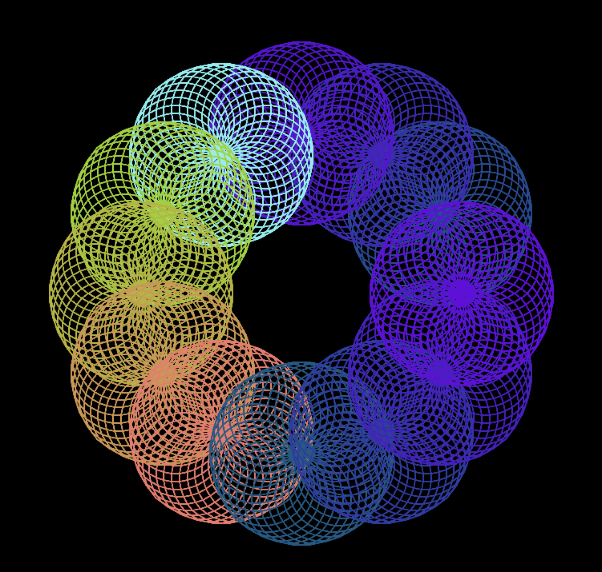

# Tortoise

## Introduction
A Haskell drawing library - the Tortoise Graphics Language, embedded in Haskell.  
Welcome to use it to draw your own picture!  
Welcome to commit! Have fun!

## Construction
Main.hs - contains a main function to save an example image to ‘tortoise.png’. It also
includes a series of example graphics of increasing complexity. Initially, only the
first example will work.  

Tests.hs - QuickCheck specifications for all functions you must implement, as well as
any support code to run the tests, depending on your environment.  

TestSupport.hs - contains support code such as Arbitrary instances and alternative
test data generation strategies for use when you are testing this assignment, and
for when we are marking it.  

Tortoise.hs - contains the definitions for the syntax and semantics of the Tortoise
Graphics Language.  

TortoiseGraphics.hs - contains a graphical backend (using the rasterific library) for
the Tortoise Graphics Language, to actually visualise your graphics.  

TortoiseCombinators.hs - contains stubs for the additional functions you are required
to implement.  

## Sample Generated Image

